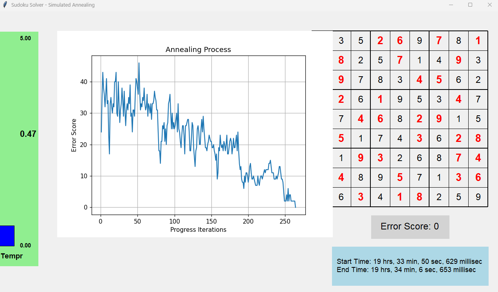

# Sudoku Solver with Simulated Annealing

This project implements a Sudoku solver using the simulated annealing algorithm. The application includes both the solving algorithm and a graphical user interface that visualizes the solving process in real-time.

## Overview

This application solves Sudoku puzzles using simulated annealing, a probabilistic technique for approximating the global optimum of a given function. The solver visualizes the entire process, showing the current state of the grid, error score, temperature parameter, and a progress graph.

## Installation

### Setting Up a Virtual Environment

```bash
# Create a virtual environment
python -m venv venv

# Activate the virtual environment
# On Windows:
venv\Scripts\activate
# On macOS/Linux:
source venv/bin/activate
```

### Installing Dependencies

```bash
# Install required packages
pip install -r requirements.txt
```


## Usage

To run the application:

```bash
python main.py
```

## How It Works

### Simulated Annealing

Simulated annealing is a probabilistic optimization algorithm inspired by the annealing process in metallurgy where metals are heated and then slowly cooled to reduce defects.

In our Sudoku solver:
1. **Initialization**: The algorithm starts with a partially filled Sudoku grid and randomly fills empty cells while respecting 3x3 block constraints.
2. **Iterative Process**: The algorithm repeatedly proposes new states by swapping two values within a 3x3 block, accepting or rejecting changes based on:
   - Whether they improve the solution (reduce errors)
   - A probability function that depends on a "temperature" parameter
3. **Cooling**: The temperature gradually decreases, making the algorithm less likely to accept worse solutions over time
4. **Reheating**: If the algorithm gets stuck, the temperature is increased to allow it to escape local optima

### Code Structure

The project is organized into three main files:

#### `logic.py`

Contains the core simulated annealing algorithm that solves the Sudoku puzzle. Key operations include:
- Setting up the initial puzzle state
- Calculating constraint violations (errors)
- Proposing and evaluating new states
- Managing the temperature parameter
- Running the annealing loop until a solution is found

#### `ui.py`

Handles the graphical interface that visualizes the solving process in real-time, including:
- Drawing the Sudoku grid and updating numbers
- Displaying the current error score
- Showing the temperature as a bar graph
- Plotting the progress of the error score over time
- Tracking execution time

#### `main.py`

Coordinates the application by:
- Setting up the initial Sudoku puzzle
- Managing shared state between the algorithm and UI
- Creating separate threads for solving and visualization
- Ensuring proper synchronization

## Screenshots




The UI displays:
- The Sudoku grid with the solution (original values in red)
- The current error score (0 when solved)
- The temperature parameter
- A graph showing error reduction over time
- Start and end times
